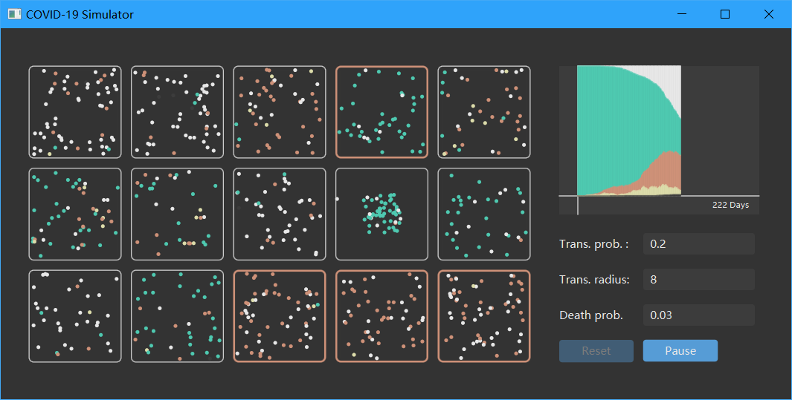
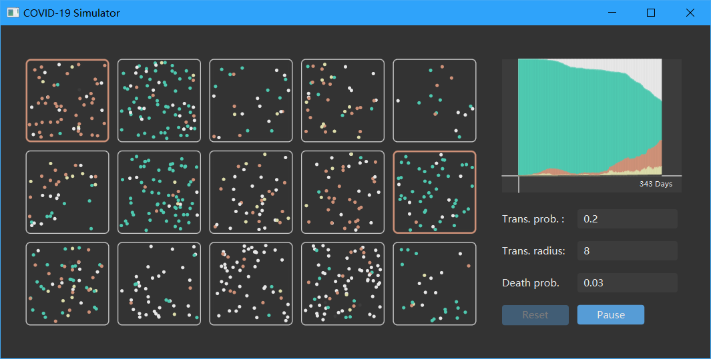

# COVID19-simulator
利用JavaFX模拟COVID-19在一个城市中传播的场景。





### 人物模型
本模型将人物抽象成一个圆点，在各自的社区内进行随机游走，或者进出其他的社区。
如果该人被传染，那么其会每间隔0.5秒向距离其小于传染半径内的所有人按一定概率传播病毒。
该概率由此人传染力和被传染者的免疫力决定。

一个人未被传染时，标志为绿色。被传染后，首先进入潜伏期，标志为黄色，此时传染力极低，
之后进入发病期，标志为红色，最后根据死亡概率死亡（标志为灰色）或康复并免疫（标志为白色）。

### 社区模型
本模型中，一个社区初始时由48个人组成，在对应的社区上：
- 点击左键可以让该社区内的半数人群聚，增加传染几率
- 按住`Alt`并点击左键可以让社区内全部人都群聚，大幅增加传染几率
- 点击右键可以切换该社区的封锁状态，社区被封锁即任何人都无法进出，且社区边框会变为红色加以区分

### 城市模型
本模型即为一个城市，该城市由15个社区组成。右上角的面板可以实时看到该城市中潜伏期、发病期、治愈、死亡和健康的人数统计数据，
右下角可以调整该病毒的参数（传播概率、传播半径、死亡概率）。

点击Start开始模拟，Pause暂停模拟，Resume继续，而Reset则会重置当前的模型。

### 目录结构
```
COVID19-simulator
└─src
    ├─common
    |      ├─Parameter.java   # 模型参数类
    |      └─Statistics.java  # 模型统计数据类
    ├─entity
    |      ├─City.java        # 城市实体类
    |      ├─Community.java   # 社区实体类
    |      └─People.java      # 人实体类
    └─ui
       ├─Controller.java      # JavaFX主窗口控制器
       ├─Main.java            # 主类
       └─main.fxml            # JavaFX主窗口界面布局
```